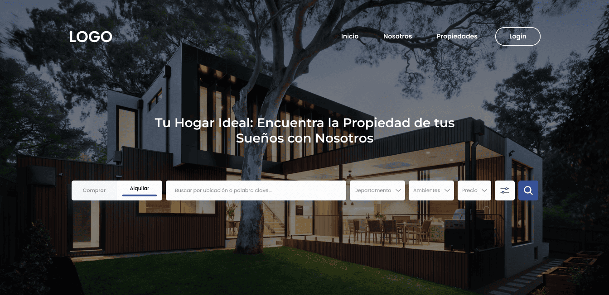
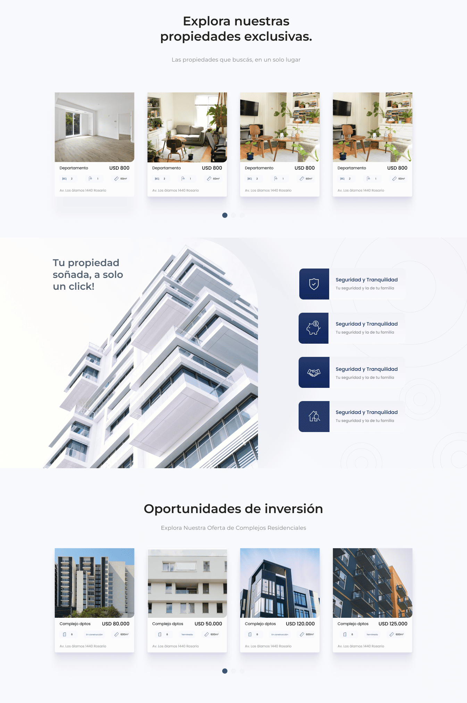
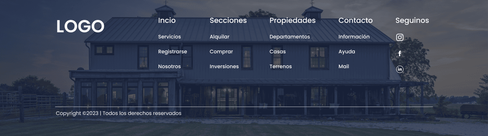

# Real Estate - Plataforma Digital Inmobiliaria

<p align="center">
  
</p>

## 🏠 Descripción del Proyecto

Inmobiliaria Logo es una plataforma digital moderna y elegante diseñada para transformar la experiencia de búsqueda y gestión de propiedades. Esta aplicación web, desarrollada con las últimas tecnologías, ofrece una interfaz intuitiva y atractiva que conecta a usuarios con sus propiedades ideales.

### ✨ Características Principales

- **Búsqueda Inteligente**: Filtros avanzados para encontrar propiedades por ubicación, tipo, precio y características
- **Galería Visual**: Presentación elegante de propiedades con imágenes de alta calidad
- **Experiencia de Usuario**: Interfaz intuitiva y responsive para todos los dispositivos
- **Autenticación Segura**: Sistema de login integrado para usuarios registrados

## 🛠️ Tecnologías Implementadas

- **Frontend**: Vue 3 con Composition API + Vite
- **Estilos**: SCSS con diseño responsive
- **Control de Versiones**: Git & GitHub
- **Despliegue**: Netlify Pages

## 🚀 Demo en Vivo

<h3>

Accede a la demo del proyecto: [Inmobiliaria Logo Demo](https://inmobiliaria-logo-tobias-moreno-techf.netlify.app/)

</h3>

## 📱 Capturas de Pantalla

<div style="display: flex; flex-direction: column; gap: 20px; align-items: center;">
  
  
  
</div>

## 💻 Instalación Local

1. **Clonar el repositorio**

   ```bash
   git clone https://github.com/TobiasEmilianoMoreno/logo-frontend.git
   cd logo-frontend
   ```

2. **Instalar dependencias**

   ```bash
   npm install
   npm install primeng primeicons chart.js
   npm install chartjs-plugin-crosshair
   npm i --save-dev @types/chartjs-plugin-crosshair
   npm install ngx-echarts echarts
   npm install -D sass-embedded
   npm install vue-router
   ```

3. **Iniciar el servidor de desarrollo**

   ```bash
   npm run dev
   ```

4. **Acceder a la aplicación**
   ```
   http://localhost:5173
   ```

## 📋 Estructura del Proyecto

```
src/
├── assets/
│   └── images/
├── components/
│   ├── Home/
│   │   ├── HeroSectionComponent.vue
│   │   ├── BenefitsSectionComponent.vue
│   │   └── FooterComponent.vue
│   ├── Dashboard/
│   │   ├── AreaMap.vue
│   │   ├── SalesStats.vue
│   │   └── TopProperties.vue
│   └── shared/
│       └── AppSelect.vue
├── views/
│   ├── HomeView.vue
│   └── DashboardView.vue
├── router/
│   └── index.js
├── main.js
└── App.vue


```

---

Desarrollado por Tobias Emiliano Moreno 2025.
